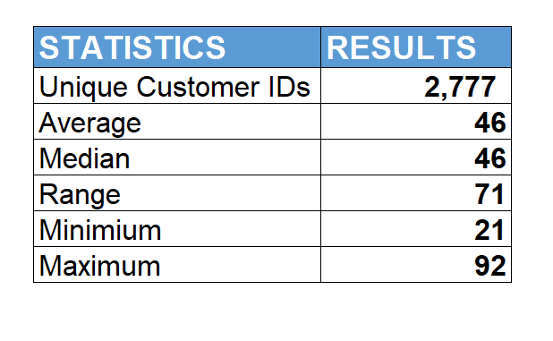
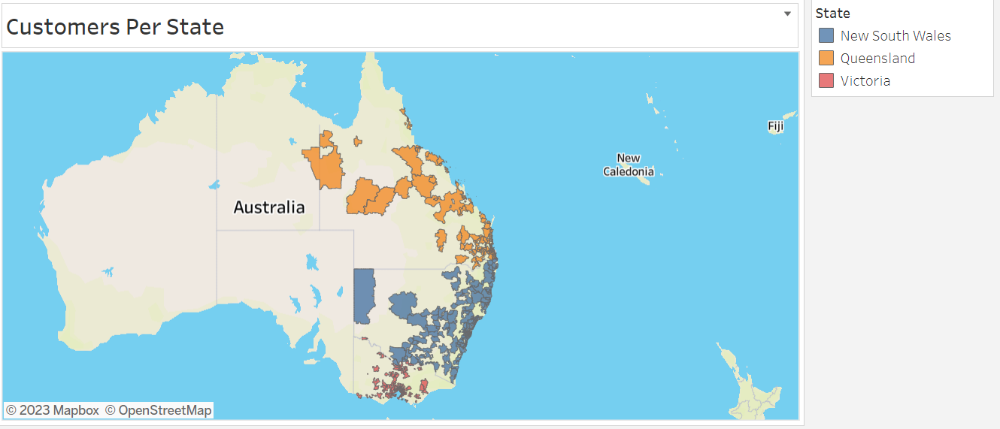
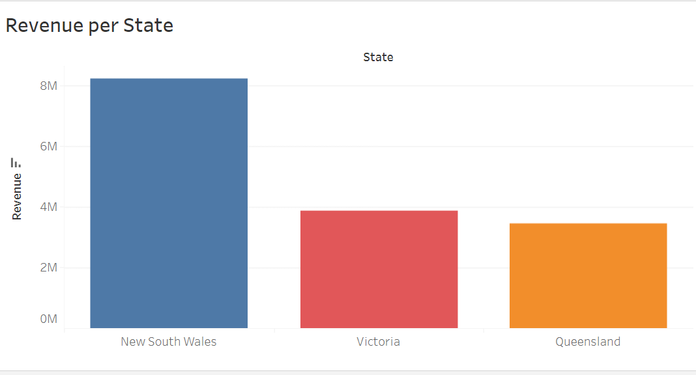
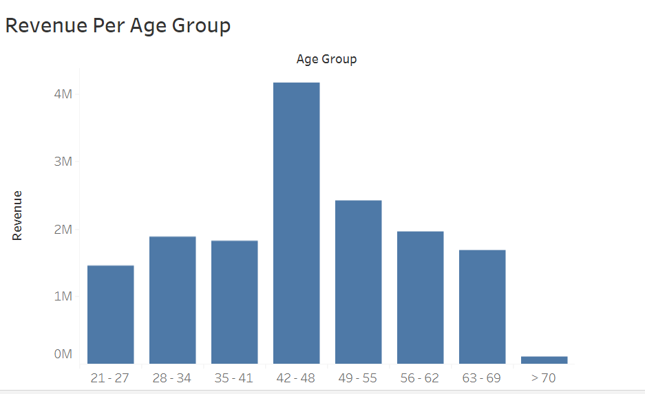
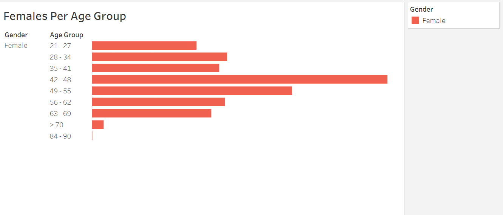
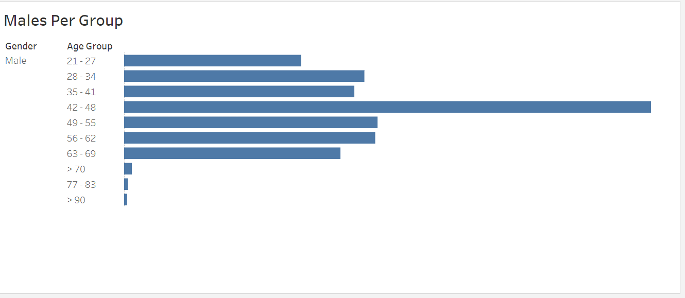
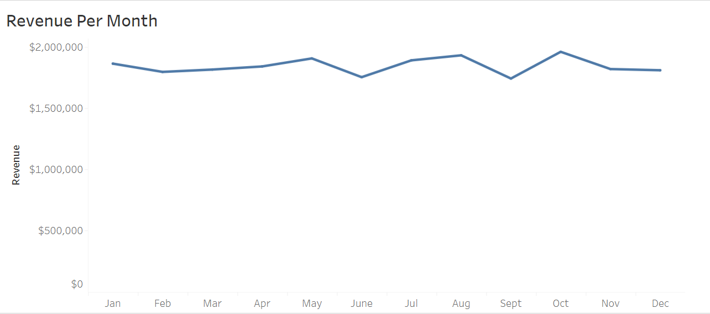
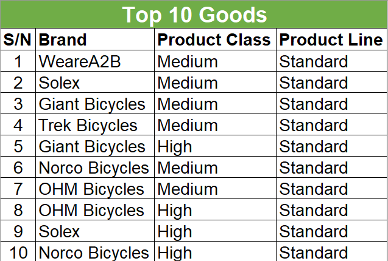

## **Table of Contents**

 1. Introduction
    
 2. Statement of Business Task

 3. Data Quality Assessment
      + 3.1 About Data
      + 3.2 Data Quality Issues and Recommendations.
          
 4. Data Analysis
       + 4.1 Exploratory Data Analysis
       + 4.2 Determine Customers per state
       + 4.3 Determine Revenue per State
       + 4.4 Determine Revenue per Age group
       + 4.5 Determine Revenue per Month
       + 4.6 Determine Top 10 goods
       + 4.7 Determine Females per Age group
       + 4.8 Determine Males per Age group
       
5. Data Insights and Presentation
    

## **1.   Introduction** 
This project is centered on Sprocket Central Pty Ltd, a mid size bikes and cycling accessories company situated in Australia. It produces 6 brands of bikes (bicycles) in different sizes and classes. The brands are as follows;

- Giant Bicycles
- Norco Bicycles
- OHM Cycles
- Solex
- Trek Bicycles
- WeareA2B

## **2.   Statement of Business Task** 
Our client is seeking the expertise of our company to assist in effectively analyzing their datasets to identify trends and behaviuor in existing customers derive data-driven insights for their marketing strategies. In order to reach this goal, we have been assigned three tasks:

- Data Quality Assessment: this task entails assessing the quality of their data, make recommendations on ways to clean and migate any issues.
- Data Analysis: this task involves analyzing existing customers' data to identify trends and behaviour.
- Data Insights and Presentation: involves using the trends and behaviour identified to give data-driven insights to the Client on new customer targets and marketing strategies as a whole.

**Key Stakeholders involved;** 

 - **Tony Smith:** Partner, KPMG's Lighthouse and Innovation
 - **Juliet Uadiale:** Junior Consultant
 - **Sprocket's marketing analytics team.**

## **3.   Data Quality Assessment**

### **3.1 About Data:**

The data set to be used is [Sprocket's existing customers data](https://cdn-assets.theforage.com/vinternship_modules/kpmg_data_analytics/KPMG_VI_New_raw_data_update_final.xlsx). It contains details about the following:

- Customer Demographics
- Customer Address
- Transactions
- New Customers' List

### **3.2 Data Quality Issues and Recommendations:**

Quite a number of issues were identified in the datasets and you can find everything [here](https://github.com/Juliet33/Sprocket-Customer-Analysis/blob/main/Data%20Quality%20Assessment.pdf).

## **4. Data Analysis**

### **4.1 Exploratory Data Analysis:**

This section shows a simple statistics of existing customers' age.

### **4.2 Determine Customers per state:**

This image shows that a large portion of the customers reside in New South Wales,  followed by Queensland and lastly, Victoria. 

### **4.3 Determine Revenue per State:**

We can see from the image above that though there are more customers situated in Queensland than Victoria, the revenue generated by Victoria based customers is higher.

### **4.4 Determine Revenue per Age Group:**

The image above shows that customers between the ages of **42 to 48 years old** generate the most revenue for Sprocket. The second highest generating age group are those between ages **49 to 55 years old**. And the third highest generating age group are those between the ages of **56 to 62 years old**.
The least revenue generating age group are customers **above 70 years old**. 

### **4.5 Determine Females per Age Group:**

 From  the above, we can see that females between the ages of **42 to 48 years old** purchase more from Sprocket than every other age group.

### **4.6 Determine Males per Age Group:**

We can say the same for males, that those between the ages of **42 to 48 years old** purchase more from Sprocket.

### **4.7 Determine Revenue per Month:**

The above shows that the month that generates the highest revenue for Sprocket is October, with August and May as the second and third highest revenue generating months respectively. 
The lowest revenue generating month is September.

### **4.8 Determine Top 10 Goods:**

      
       
