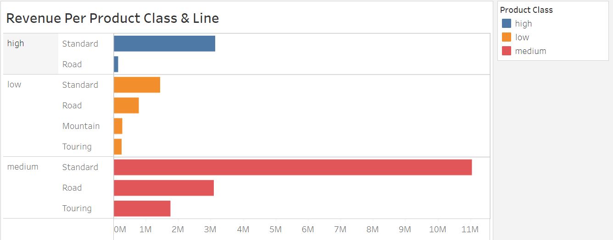
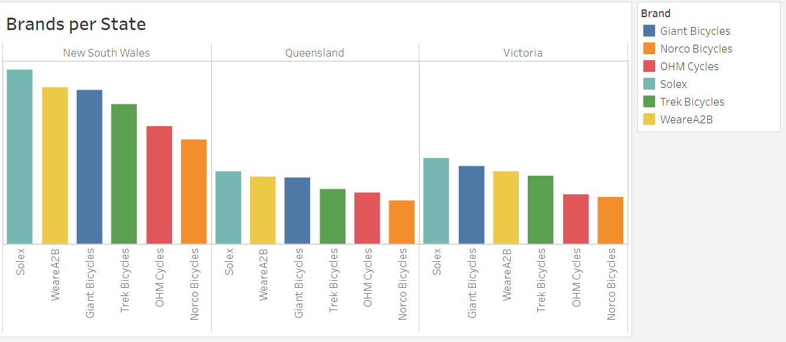

## **Table of Contents**

 1. Introduction
    
 2. Statement of Business Task

 3. Data Quality Assessment
      + 3.1. About Data
      + 3.2. Data Quality Issues and Recommendations.
          
 4. Data Analysis
       + 4.1. Exploratory Data Analysis
       + 4.2. Determine Customers per state
       + 4.3. Determine Revenue per State
       + 4.4. Determine Revenue per Age group
       + 4.5. Determine Females per Age group
       + 4.6. Determine Males per Age group
       + 4.7. Determine Revenue per Month
       + 4.8. Determine Revenue per Product Class & Line
       + 4.9. Determine Brands per State
       + 4.10. Determine Top 10 Goods
       
       
5. Presentation
6. Recommendations
    

## **1.   Introduction** 
This project is centered on Sprocket Central Pty Ltd, a mid size bikes and cycling accessories company situated in Australia. It produces 6 brands of bikes (bicycles) in different product lines and classes. 

**The brands are as follows:**
- Giant Bicycles
- Norco Bicycles
- OHM Cycles
- Solex
- Trek Bicycles
- WeareA2B

**The Product Lines are:**
  - Mountain
  - Road
  - Standard
  - Touring
 
 **The Product Classes are:**
  - Low
  - Medium
  - High

## **2.   Statement of Business Task** 
Our client is seeking the expertise of our company to assist in effectively analyzing their datasets to identify trends and behaviuor in existing customers derive data-driven insights for their marketing strategies. In order to reach this goal, we have been assigned three tasks:

- **Data Quality Assessment:** this task entails assessing the quality of their data, make recommendations on ways to clean and migate any issues.
- **Data Analysis:** this task involves analyzing existing customers' data to identify trends and behaviour.
- **Data Insights and Presentation:** involves using the data insights derived from existing customers' analysis to target potential high value customers from the list of new customers given to us. 

**Key Stakeholders involved;** 

 - **Tony Smith:** Partner, KPMG's Lighthouse and Innovation
 - **Juliet Uadiale:** Junior Consultant
 - **Sprocket's marketing analytics team.**

## **3.   Data Quality Assessment**

### **3.1. About Data:**

The data set to be used is [Sprocket's existing customers data](https://cdn-assets.theforage.com/vinternship_modules/kpmg_data_analytics/KPMG_VI_New_raw_data_update_final.xlsx). It contains details about the following:

- Customer Demographics
- Customer Address
- Transactions
- New Customers' List

### **3.2. Data Quality Issues and Recommendations:**

Quite a number of issues were identified in the datasets and you can find everything [here](https://github.com/Juliet33/Sprocket-Customer-Analysis/blob/main/Data%20Quality%20Assessment.pdf).

## **4. Data Analysis**

### **4.1. Exploratory Data Analysis:**

This section shows a simple statistics of existing customers' age.

### **4.2. Determine Customers per state:**

This image shows that a large portion of the customers reside in New South Wales,  followed by Queensland and lastly, Victoria. 

### **4.3. Determine Revenue per State:**

We can see from the image above that though there are more customers situated in Queensland than Victoria, the revenue generated by Victoria based customers is higher.

### **4.4. Determine Revenue per Age Group:**

The image above shows that customers between the ages of **42 to 48 years old** generate the most revenue for Sprocket. The second highest generating age group are those between ages **49 to 55 years old**. And the third highest generating age group are those between the ages of **56 to 62 years old**.
The least revenue generating age group are customers **above 70 years old**. 

### **4.5. Determine Females per Age Group:**

 From  the above, we can see that females between the ages of **42 to 48 years old** purchase more from Sprocket than every other age group.

### **4.6. Determine Males per Age Group:**

We can say the same for males, that those between the ages of **42 to 48 years old** purchase more from Sprocket.

### **4.7. Determine Revenue per Month:**

The above shows that the month that generates the highest revenue for Sprocket is October, with August and May as the second and third highest revenue generating months respectively. 
The lowest revenue generating month is September.

### **4.8. Determine Revenue per Product Category:**

The above shows that the **Medium, Standard** is the highest generating product category for Sprocket and the least revenue generating product category is the **High, Road**.

### **4.9. Determine Brands per State:**

The analysis shows that all brands are thriving well in the New South Wales state, seconded by Victoria and Queensland is the least.

### **4.10. Determine Top 10 Goods:**

The above shows the top 10 goods purchased by Sprocket's existing customers. 
The **Standard** Product line is the most preferred product line.
The **Medium** and **High** product classes are also favourites.

      
       

## **5. Presentation**

Please find the dashboard showing details for the target customers [here](https://public.tableau.com/app/profile/juliet.uadiale/viz/SprocketTargetCustomers_16901315213920/Dashboard1).

## **6. Recommendations**

In order for Sprocket to increase revenue by targeting high value customers, the following recommendations have been provided:

a. The analysis showed the highest revenue generating month to be October and the lowest to be September. Sprocket should use the month of September to produce more products in preparedness for October to take advantage of the high demand.

b. Male and Female customers between the ages of 42 to 48 years old should be focused more on because they generate 48% of Sprocket's revenue.

c. Customers who reside in New South Wales should be of primary focus and all the brands should be promoted here with **Solex** being of top priority.

d. The Medium, Standard product category should be of top most prioty because it generates 50% of the annual revenue of Sprocket. 

e. The production of the High, Road product category should be stopped and the resources diverted to the production of the Medium, Road and High, Standard product categories.
